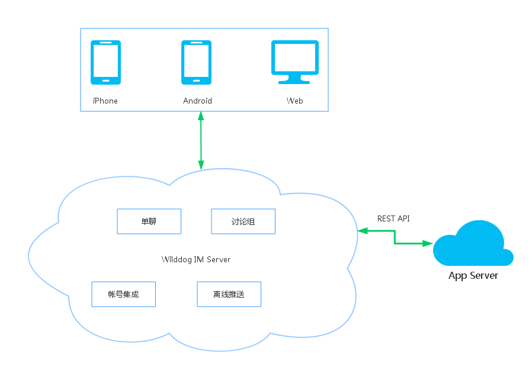

###产品概述

* 1 简介
* 2 架构介绍
* 3 业务介绍
 * 3.1 单聊
 * 3.2 讨论组
 * 3.3 账号登录集成
 * 3.4 离线推送系统

#### 1 简介

野狗 IM 解决方案（WilddogIM）是野狗在野狗实时后端云基础上实现的 IM 服务，旨在为移动应用开发者提供强大的实时通信功能。解决开发者面临的实时消息安全性、稳定性、速度慢等一系列问题。

#### 2 架构介绍
野狗 IM 解决方案提供单聊、讨论组、账号集成、离线推送等功能。并提供完善的 APP 接入。

#### 3 业务介绍
##### 3.1 单聊
支持文本、语音、图片、emoji 等消息类型。

##### 3.2 讨论组
高度灵活的讨论组功能，能适应各种功能扩展。

##### 3.3 帐号登录集成
轻松集成 App 已有帐号系统，兼容性高。

##### 3.4 离线推送系统
即使 App 离线，也能正常收到实时消息。